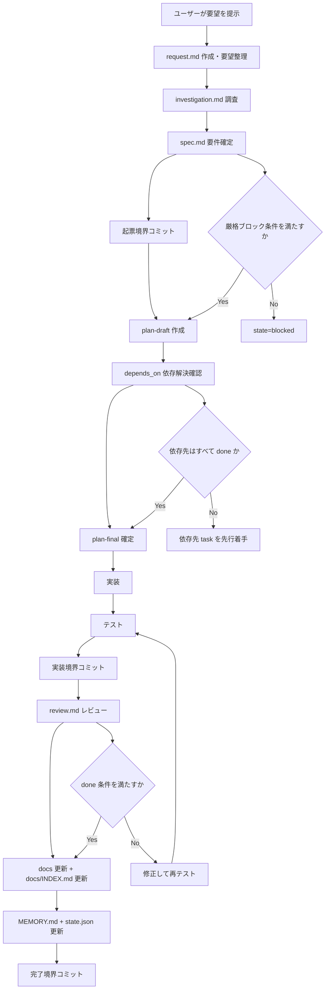

# ユーザー要望から実装・コミットまでのフロー可視化ガイド

## 前提知識 (Prerequisites / 前提知識) [空欄禁止]

- 参照資料:
  - `AGENTS.md`
  - `docs/INDEX.md`
- 理解ポイント:
  - 本資料に入る前に、目的・受入条件・依存関係を把握する。


## 1. 目的

この資料は、ユーザーが CLI で要望を出してから、エージェントが実装してコミットするまでの流れを一枚で理解するためのガイドです。

対象読者:
- AgentRail を初めて使う依頼者
- タスク進行をレビューする実装者

## 2. 全体フロー図



## 3. 工程ごとの出来事

1. 要望提示: ユーザーが CLI で依頼内容を入力する。
2. 要望整理: `work/<task-id>/request.md` に要望と成功条件を記録する。
3. 前提知識整理: task 資料に `前提知識` セクションを記載し、参照先を解決可能にする。
4. 調査: `investigation.md` で現状確認と仮説を整理する。
5. 要件確定: `spec.md` に受入条件とテスト要件を定義する。
6. 実装計画ドラフト: `plan-draft` を作成し、探索用の実施方針を記録する。
7. 依存解決確認: `state.json` の `depends_on` を確認し、未解決依存があれば先行タスクへ切り替える。
8. 実装計画確定: gate pass 後に `plan-final` を確定する。
9. 実装: コード/ドキュメントを変更する。
10. テスト: 実行コマンドで期待結果を検証する。
11. レビュー: `review.md` に AC 判定・テスト結果・Process Findings を記録する。
12. 資料更新: 変更した docs を更新し、`docs/INDEX.md` へ導線を追加する。
13. 記憶更新: `MEMORY.md` と `state.json` を最新化する。
14. コミット: 変更を意味のある単位でコミットする。

## 3.1 コミット境界ルール

差分混在を防ぐため、コミットを次の3境界で行う。

1. 起票境界コミット: 起票と要件確定（request/investigation/spec/plan-draft）完了時
2. 実装境界コミット: depends_on gate 通過後の plan-final 確定 + 実装 + テスト完了時
3. 完了境界コミット: review/docs/memory/state 更新完了時

境界コミット前の推奨確認:

```powershell
pwsh -NoProfile -File tools/commit-boundary/check-staged-files.ps1 -TaskId <task-id> -Phase kickoff
pwsh -NoProfile -File tools/commit-boundary/check-staged-files.ps1 -TaskId <task-id> -Phase implementation
pwsh -NoProfile -File tools/commit-boundary/check-staged-files.ps1 -TaskId <task-id> -Phase finalize -AllowCommonSharedPaths
```

## 4. blocked / done の判断ポイント

blocked になる例:
- `spec.md` の空欄禁止項目が未記入
- `plan.md` が `spec.md` を参照していない
- `docs/INDEX.md` の更新漏れ
- `project.profile.yaml` の必須キー不足

done にする条件:
- spec の受入条件をすべて満たす
- テスト要件の実施結果を `review.md` に記録する
- 関連 docs と `docs/INDEX.md` を更新する
- `MEMORY.md` と `state.json` が最新状態である

## 5. CLI 要望サンプル（docs改善題材）

```text
ユーザー:
既存の運用手順が初見に分かりにくいです。
要望提示から実装・コミットまでの流れを図で理解できる資料を追加してください。
CLI での依頼例と、AI の返答例も載せてください。
```

## 6. AI 応答サンプル

初動応答の例:

```text
AI:
要望を確認しました。まず既存の運用資料と INDEX 構造を調査し、
新規資料の配置先・図の構成・サンプル文面を確定します。
その後に docs を追加して INDEX へ導線を登録し、整合チェックまで実施します。
```

完了報告の例:

```text
AI:
実装が完了しました。
- 追加: docs/operations/framework-request-to-commit-visual-guide.md
- 更新: docs/INDEX.md, work/<task-id>/review.md, work/<task-id>/state.json
- テスト: docs-indexer PASS / consistency-check PASS
- コミット: <commit-hash>
次アクション: 資料レビュー後に最優先タスクへ着手します。
```

## 7. 最短チェックリスト

依頼者向け:
- 何を達成したいか（成功条件）を1〜3行で書く
- 対象範囲（In Scope / Out of Scope）を示す
- いつまでに必要かを示す

実装者向け:
- `spec.md` と `plan.md` を埋めてから実装する
- テスト結果を `review.md` に残す
- `docs/INDEX.md`, `MEMORY.md`, `state.json` を更新する
- コミット前に境界チェック（`tools/commit-boundary/check-staged-files.ps1`）と consistency-check を通す
